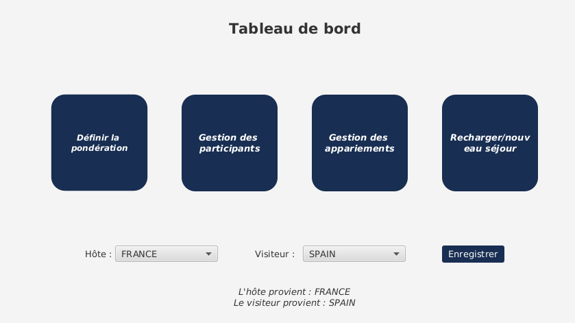
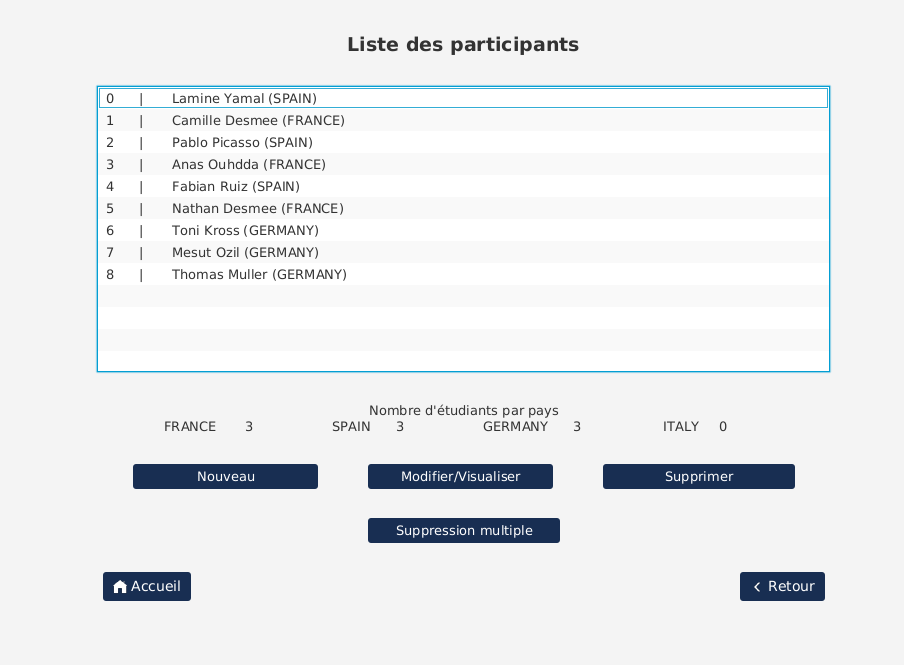
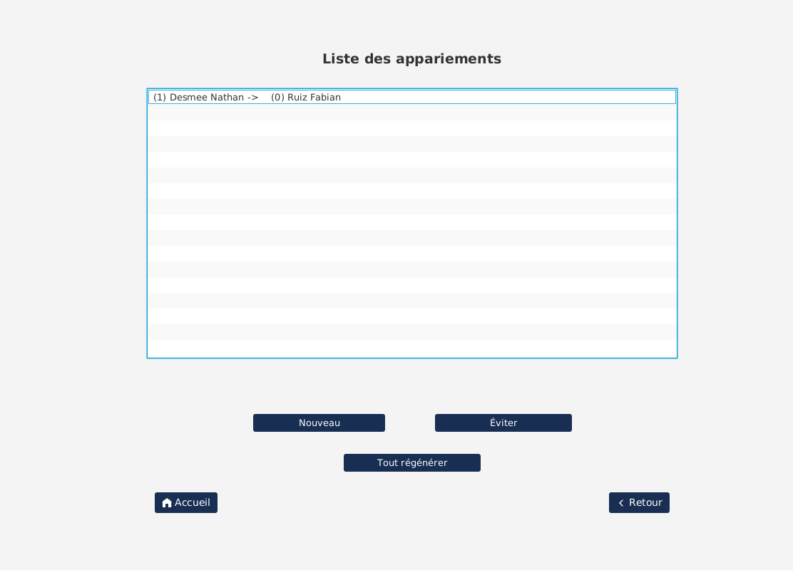
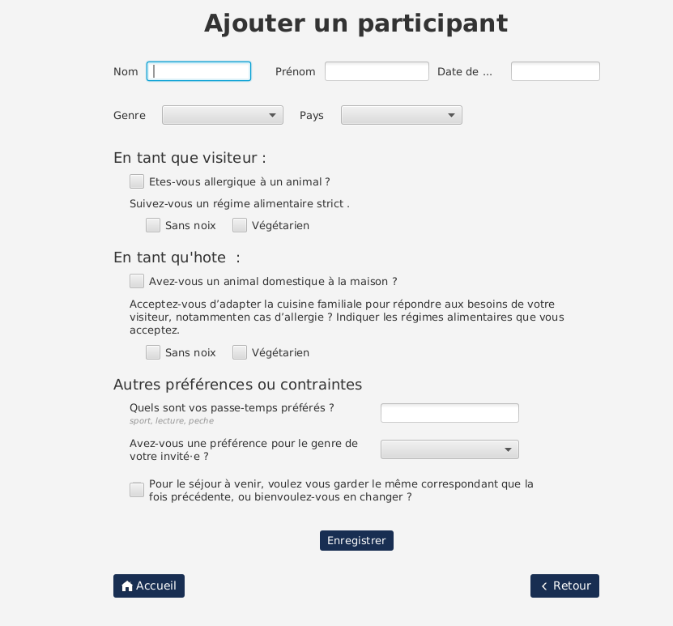

  SAE S2.01 S2.02 -- Rapport pour la ressource IHM
  ===

  *Desmee Nathan, Ouhdda Anas, Belguebli Rayane Groupe A1*
  
# **Lien vers le repo GitLab**
  ---
  
[*Repo GitLab*](https://gitlab.univ-lille.fr/sae2.01-2.02/2023/A1.git)

# **Capture d’écran de l’application finale**
  ---

# **Justification de nos choix de conception**
  ---

Au début nous avons décidé de séparer l'application en deux parties. La première est la partie destinée à l'ajout des étudiants tandis que la deuxième est destinée à la gestion du voyage. On a choisi de séparer les deux parties car l'utilisateur peut directement ouvrir la page des ajouts pour que les étudiants ajoutent eux même leurs données sans pour autant qu'ils voient les informations des autres étudiants ou autres infomations sensibles depuis les autres menus. Le menu d'ajout est très rapide et explicite car il suffit de remplir les zones de textes ou alors de cocher des cases avec de multiples explications. Le deuxième menu nommé tableau de bord permet d'avoir accès à de multiples fonctionnalitées. Premièrement nous avons la personnalisation des pondations c'est à dire le poids en moins pour une préference, le poids en plus pour une contrainte et enfin le poids de base (sans aucunes préferences, contraintes ou autres). Deuxième nous avons ajouté la possibilité de visualiser les appariements fait en fonction des 2 pays sélectionnés au début et des étudiants faisant parti de ce pays, mais nous avons aussi permi la possibilité de fixer ou d'éviter des appariements entre 2 étudiants grâce à leur ID. Troisième la possibilité de visualiser, modifier, supprimer tous les étudiants enregistrer. Et comme dernière fonctionnalité celle de pouvoir exporter l'historique des appariements fait en fichier binnaire.

[*MaquetteV1*](mockups/Maquette.pdf)

 Mais après reflexion nous avons choisi de refaire un seul est simple menu avec toutes les fonctionnalités pondération, appariement, exportation présenté précédement et dans la partie visualisation des étudiants la possibilité là d'ajouter un participant en plus de la modification ou de la suppression. Donc nous somme partie sur le fait que ce soit que l'organisateur qui puisse utiliser cette application.

[*MaquetteV2*](mockups/MaquetteV2.pdf) 

# **Contributions de chaque membre du groupe**
  ---

Nous avons tous les trois conçu le prototype de l'application sur Figma en réfléchissant ensemble sur les fonctionnalitées optimales. Anass Ouhdda s'est occupé de la création de l'application avec l'aide notamment de l'application SceneBuilder où il pas pu fabriquer les différents menus puis mettre les différentes interactions dans un fichier java. Nathan Desmee s'est lui occupé du fond du code c'est à dire des fonctionnalités qui interragissent en les fichiers java réalisant les importations et affectations. Pour finir, Rayane Belguebli s'est lui occupé du calcul des poids lors des affectations, il a contribué à la réalisation des affectations et enfin il s'est occupé des rendus textuels avec l'aide de Nathan Desmee. 

