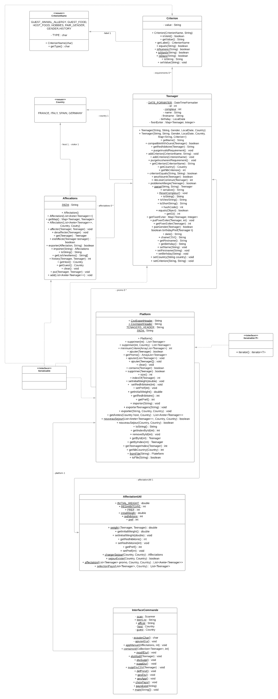

  SAE S2.01 S2.02 -- Rapport pour la ressource POO
  ===

  *Desmee Nathan, Ouhdda Anas, Belguebli Rayane Groupe A1*
  
# **Lancement Application**
  ---

  Démarrer l'application en ligne de commande avec le jar :

```bash
$ java -jar languageStayCLI.jar
```

  Démarrer l'application en ligne de commande sans le jar :

Lancer avec votre IDE la Classe [*InterfaceCommande.java*](src/languageStay/InterfaceCommande.java) 

Démarrer l'application en interface graphique :

```bash
$ java --module-path=lib/javafx-sdk-17.0.2/lib --add-modules=javafx.controls,javafx.fxml  
 ,javafx.graphics -jar languageStayGUI.jar
```

# **Diagramme UML**
  ---

  

# **Analyse technique et critique de l’implémentation des fonctionnalités demandées**
  ---

 Nous avons suivi et répondu au cahier des charges indiqué dans le sujet, toutes les fonctionnalités demandées ont été implémenté, nous pensons avoir ajouté toutes les méthodes utiles pour répondre au sujet sans ajouter de méthode non utilisé, toutes les méthodes sont commentées avec à quoi sert la méthode, les paramètres, qu'est-ce qu'elle retourne... Malgré ça nous pensons qu'il y a quand même de la redondance dans notre code des méthodes qu'on aurait plus simplement généraliser pour les utiliser de différentes manières ce qui aurait évité l'ajout de certaines méthodes. Pour l'aspect technique nous avons surtout utilisé l'encapsulation entre nos classes exemple la Map de critère dans la classe `Teenager.java` qui nous sert à lister tous les critères d'un Teenager. Nous avons aussi utilisé la sérialisation et les iterator pour pouvoir récupérer et gérer l'historique avec un fichier binaire. Comme autres points techniques il y a externalisation et lecture de données pour gérer les fichiers CSV que nous avons utilisés, les exceptions qui nous ont servi pour la compatibilité entre les participants, le bon format des critères... Pour la répartition du travail nous n'avons pas prévu à l'avance qui aller faire qui chacun à fait ce qui avait faire au fil des demandes et des rendus de manière à ce que tout le monde travail et que le travail soit rendu à temps. Plus précisément Belguebli Rayane a commencé la création des classes principales comme `Teenager.java`, `Criterion.java`, `Platefrom.java` puis a gérer plus dans la suite les classes liées au affection de la partie graphe AffectationUtil, Affectation. Nathan Desmee a gérer les exceptions la gestion de la compatibilité et la majorité des méthodes utilisées pour réaliser l'interface non-graphique. Anas Ouhdda a lui gérer la partie exportation et lecture de fichier, sérialisation binaire et beaucoup de méthode lié à la classe `Plateform.java`. 


# **Analyse quantitative/qualitative des tests**
 ---

 Pour les tests dès que nous ajoutons une méthode retournant une information utile exemple : le nombre de loisirs en commun, la compatibilité entre adolescents, les importations/exportations. Nous l'a testions, pour la qualité nous avons essayé au mieux de tester le plus de résultat possible pour être sûr que nos méthodes faisaient bien ce qu'on attendaient, pour la quantité de méthode on s'est bien sûr passé de tester les méthodes qui étaient utilisées dans d'autres méthodes pour éviter la redondance. Mais nous pensons quand même que certaines méthodes qui modifient un objet aurait dû avoir un test ce que nous avons point fait.


  - [*CriterionTest.java*](test/languageStay/CriterionTest.java)
  - [*PlatformTest.java*](test/languageStay/PlatformTest.java)
  - [*TeenagerTest.java*](test/languageStay/TeenagerTest.java)

